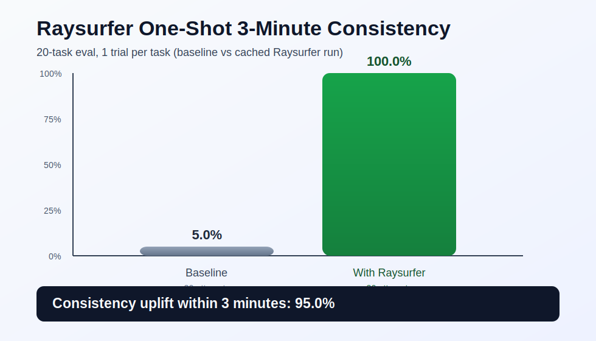

# Raysurfer One-Shot Consistency Eval

A minimal public eval for testing whether code-heavy tasks can be completed in one shot within **3 minutes** by reusing verified snippets.

This eval is intentionally:
- Non-LLM for task execution logic (no summarization or text-to-text generation tasks)
- Focused on long, implementation-heavy code paths
- Scored on consistency, not one-off wins

## Metric

Primary metric: **3-minute consistency**

`consistency = completed_within_180_seconds / total_attempts`

Run each task multiple times (recommended: 5 trials) in two modes:
- Baseline agent (no Raysurfer reuse)
- Agent with Raysurfer snippet reuse

Then compare consistency and uplift.

## Repo Layout

- `tasks/tasks.json`: 20 eval tasks with one-shot prompts and acceptance checks
- `runs/run_log_template.json`: schema template for logging trial outcomes
- `scripts/run_agent_eval.py`: benchmark runner for `baseline` and `raysurfer` modes
- `scripts/seed_verified_snippets.py`: seeds reusable verified snippets for eval prompts
- `scripts/score_eval.py`: tiny scorer for consistency and baseline-vs-Raysurfer deltas
- `scripts/generate_chart.py`: generates SVG summary charts from score JSON
- `.github/workflows/gitleaks.yml`: secret scanning on push/PR

## Quickstart

1. Start local backend (auth disabled in `raysurfer-backend/.env`):

```bash
cd ../raysurfer-backend
uv run uvicorn app.main:app --port 8000
```

2. In another shell, seed eval snippets:

```bash
cd ../examples/raysurfer-public-oneshot-eval
RAYSURFER_BASE_URL=http://127.0.0.1:8000 RAYSURFER_API_KEY=local-dev-key \
uv run python scripts/seed_verified_snippets.py
```

3. Run baseline (strict 3-minute SLA via `--timeout-seconds 180`):

```bash
uv run python scripts/run_agent_eval.py \
  --mode baseline \
  --out runs/baseline.json \
  --max-turns 4 \
  --timeout-seconds 180
```

4. Run Raysurfer reuse mode:

```bash
RAYSURFER_BASE_URL=http://127.0.0.1:8000 RAYSURFER_API_KEY=local-dev-key \
uv run python scripts/run_agent_eval.py \
  --mode raysurfer \
  --out runs/with_raysurfer.json \
  --max-turns 4 \
  --timeout-seconds 180
```

5. Score and generate chart:

```bash
uv run python scripts/score_eval.py \
  --tasks tasks/tasks.json \
  --raysurfer-runs runs/with_raysurfer.json \
  --baseline-runs runs/baseline.json \
  --json-out runs/summary.json

uv run python scripts/generate_chart.py \
  --summary runs/summary.json \
  --out assets/consistency_comparison.svg
```

## Latest Benchmark (February 20, 2026)

- SLA: 180 seconds (3 minutes)
- Task count: 20
- Trials per task: 1
- Setup: pre-seeded verified snippets per task via `scripts/seed_verified_snippets.py`
- Baseline consistency: **5.0%** (1/20)
- Raysurfer consistency: **100.0%** (20/20)
- Uplift: **+95.0 percentage points**



## Task Set (20)

1. Resumable paginated API to Postgres ETL
2. CSV-to-warehouse loader with schema evolution
3. Double-entry ledger reconciliation engine
4. RBAC + ABAC policy evaluator with audit logs
5. OAuth2 multi-tenant API client with safe token refresh
6. Webhook gateway with signature validation + replay protection
7. Resumable directory sync CLI with delta uploads
8. Deterministic crawler with canonicalization and incremental state
9. Event-sourced cart engine with snapshots and replay
10. Recurring billing and proration engine
11. Feature flag engine with percentage rollout and sticky bucketing
12. Timezone-aware shift scheduler with labor constraints
13. JSON-schema compiler to runtime validators
14. Durable job queue with retries, visibility timeout, and DLQ
15. Resilient HTTP client with circuit breaker and hedged requests
16. JSON diff/patch engine with reversible operations
17. Multi-format report pack generator (CSV/XLSX/PDF)
18. YAML infra planner with dependency ordering and cycle detection
19. Stateful log parser with multiline stitching and PII redaction
20. Release orchestrator with semver, changelog, and artifact checksums

## Secret Scanning (Gitleaks)

- CI runs on every push and pull request via `.github/workflows/gitleaks.yml`.
- Local scan:

```bash
gitleaks detect --source . --config .gitleaks.toml
```

## Publish as a Public GitHub Repo

From this folder:

```bash
cd examples/raysurfer-public-oneshot-eval
git init
git add .
git commit -m "Add Raysurfer one-shot 3-minute consistency eval"
gh repo create raysurfer-oneshot-consistency-eval --public --source=. --push
```
